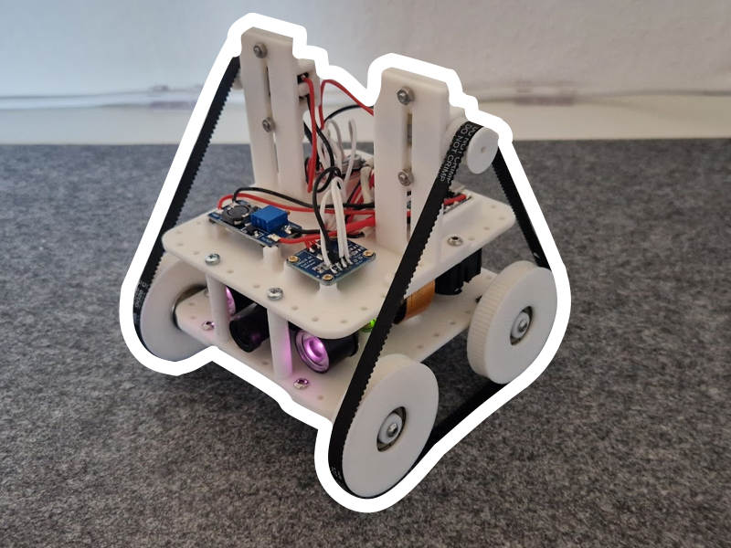
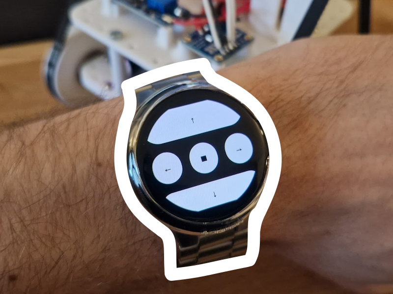

# Custos
Small robot with belt-drive.

## Wear OS control

Featuring a wear os app, to control it with my Pixel Watch:

## Wiring

- INA219:
    - GPIO2, GPIO3 
- Servo:
    - GPIO23
- L298N Mini:
    - GPIO26 = INA1
    - GPIO19 = INA2
    - GPIO13 = INA3
    - GPIO06 = INA4

## Setting raspberry autostart services up

* Make `server.py` executable
    * $ `chmod +x server.py`
* Copy `robot.service` to `/lib/systemd/system`
* Change `ExecStart=` command inside `*.service` accordingly to path where `server.py` is located
* Enable daemon process
    * $ `sudo systemctl daemon-reload`
    * $ `sudo systemctl enable robot.service`
    * $ `sudo systemctl start robot.service`
* Enable daily reboot at 4am (to automatically fix (e.g.) networking errors)
  * `sudo crontab -e`
  * Enter as new line and save --> `0 4 * * * /sbin/reboot`

### Useful commands for process monitoring

* Check status
    * $ `sudo systemctl status robot.service`
* Start service
    * $ `sudo systemctl start robot.service`
* Stop service
    * $ `sudo systemctl stop robot.service`
* Check service's log
    * $ `sudo journalctl -f -u robot.service`